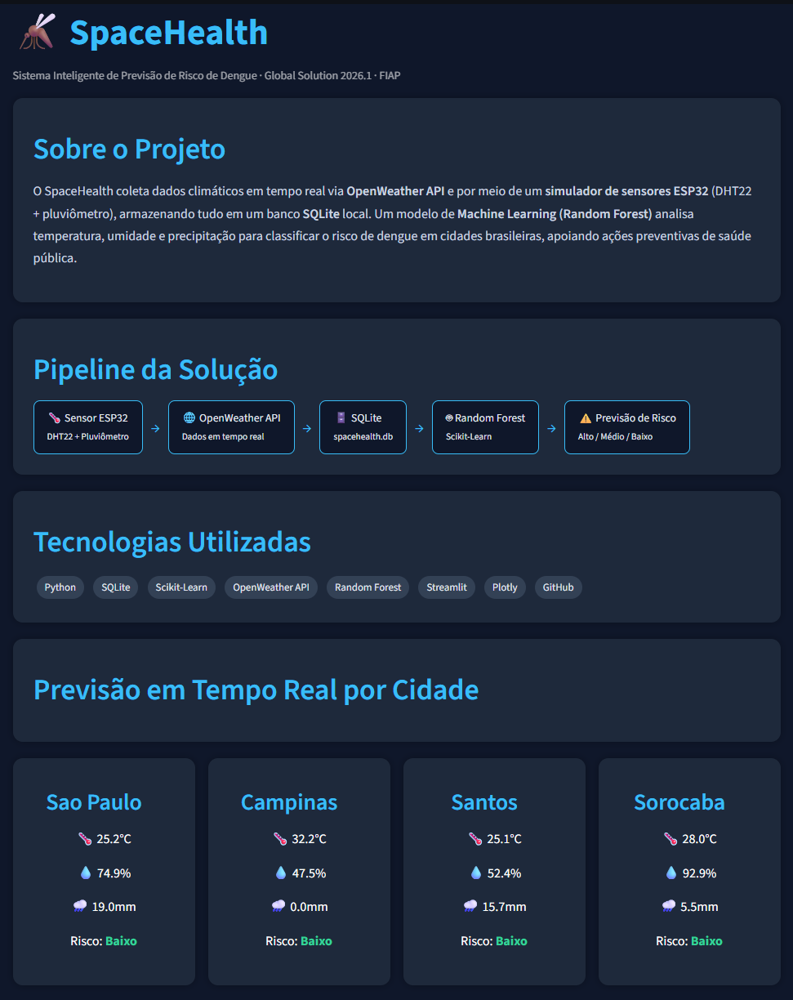

# FIAP - Faculdade de Informática e Administração Paulista

<p align="center">
    <a href="https://www.fiap.com.br/"></a>
</p>

<br>

# SpaceHealth

## 🔗 Sistema Inteligente de Previsão de Risco de Dengue

### 👤 Integrante

- RM567169 - Giovanna Gomes Oliveira
- RM568044 - Gabriel Coppola
- RM567250 - Cloves Silva Filho

## 👩‍🏫 Tutora

- <a href="https://github.com/SabrinaOtoni">Sabrina Otoni</a>

---

## 📖 Descrição

O SpaceHealth é uma solução desenvolvida para auxiliar na previsão de risco de dengue utilizando dados climáticos coletados através da API OpenWeather.

O sistema integra Inteligência Artificial, Machine Learning, Banco de Dados SQLite e uma interface web para análise dos dados.

A proposta utiliza informações de temperatura e precipitação para identificar padrões associados ao aumento do risco de dengue em cidades brasileiras.

---

## 🚀 Tecnologias Utilizadas

- Python
- SQLite (sqlite3)
- Machine Learning (Scikit-Learn)
- OpenWeather API
- Streamlit
- Plotly
- HTML5
- CSS3
- GitHub

---

## 📁 Estrutura do Projeto

```text
SpaceHealth/

├── src/
│   ├── __init__.py
│   ├── setup_db.py
│   ├── dashboard.py
│   ├── repository/
│   │   ├── __init__.py
│   │   ├── conexao.py
│   │   ├── cidade_repository.py
│   │   └── clima_repository.py
│   ├── service/
│   │   ├── __init__.py
│   │   ├── clima_service.py
│   │   ├── sensor_service.py
│   │   └── ml_service.py
│   └── templates/
│       └── index.html
├── data/
│   ├── dataset_treino.csv
│   └── chart.csv
├── requirements.txt
├── spacehealth.db
├── README.md
└── docs/
    └── imagens/
```

---

## ⚙️ Funcionalidades

- Cadastro de cidades
- Coleta automática de dados climáticos via OpenWeather API
- Simulação de sensores ESP32 (DHT22 + pluviômetro)
- Armazenamento em SQLite (sem necessidade de servidor)
- Treinamento do modelo de Machine Learning
- Previsão de risco de dengue
- Dashboard analítico
- Interface Web em HTML

---

## 📊 Dashboard Interativo (Streamlit + Plotly)

Dashboard analítico construído com Streamlit e Plotly, exibindo as leituras dos sensores, KPIs e a previsão de risco por cidade em tempo real.



---

## 🗃️ Banco de Dados

Banco utilizado:

- SQLite — arquivo `spacehealth.db` gerado automaticamente, sem necessidade de servidor

Tabelas principais:

- cidades
- clima

---

## 🤖 Machine Learning

O modelo (Random Forest, Scikit-Learn) é treinado com **dados reais**:

- **Casos de dengue** — SINAN 2012–2021 (12,4 milhões de notificações), agregados por mês e filtrados por confirmação (`CLASSI_FIN`).
- **Clima** — normais climáticas mensais do Brasil (Banco Mundial, 1991–2020): temperatura média e precipitação.

As duas bases são cruzadas por mês em `data/dataset_treino.csv`. O rótulo `risco` (Alto / Medio / Baixo) é derivado do **tercil dos casos confirmados reais** — não de regra arbitrária.

Variáveis de entrada do modelo:

- Temperatura
- Precipitação (chuva)

Observação relevante: o pico de chuva ocorre entre janeiro e março, enquanto o pico de casos vai de fevereiro a maio — defasagem de ~1 mês compatível com o ciclo de proliferação do *Aedes aegypti* após as chuvas.

Objetivo:

- Identificar padrões climáticos relacionados ao aumento do risco de dengue.

---

## 📚 Fontes de Dados

Os dados de treinamento foram extraídos de bases públicas:

- **Casos de dengue (epidemiológico)** — SINAN, Brasil 2012–2021
  <https://data.mendeley.com/datasets/2d3kr8zynf/4>

- **Dados climáticos históricos** — normais mensais do Brasil 1991–2020, Banco Mundial (Climate Change Knowledge Portal)
  <https://climateknowledgeportal.worldbank.org/country/brazil/climate-data-historical>

---

## ▶️ Como Executar

**Pré-requisito:** Python 3.10+

Criar e ativar ambiente virtual:

```bash
python -m venv .venv

# Windows
.venv\Scripts\activate
```

Instalar dependências:

```bash
pip install -r requirements.txt
```

Criar o banco de dados e tabelas (executar uma vez):

```bash
python -m src.setup_db
```

Verificar conexão:

```bash
python -m src.repository.conexao
```

Iniciar simulador de sensores ESP32 (terminal separado, deixar rodando):

```bash
python -m src.service.sensor_service
```

Treinar modelo e gerar previsão com dados reais (SINAN + clima Banco Mundial):

```bash
python -m src.service.ml_service
```

Executar coleta climática via OpenWeather API:

```bash
python -m src.service.clima_service
```

Iniciar o dashboard interativo (Streamlit + Plotly):

```bash
streamlit run src/dashboard.py
```

---

## 🎥 Vídeo Demonstrativo

Adicionar o link do vídeo após o upload para o YouTube:

```text
https://youtu.be/v0I4eZE6fM8
```

---

## 📊 Resultados Esperados

O sistema permite identificar cidades com maior probabilidade de ocorrência de dengue através da análise de dados climáticos.

A solução pode auxiliar órgãos públicos e profissionais da saúde na tomada de decisões preventivas.

---

## 🎯 Conclusão

O projeto SpaceHealth demonstra a aplicação prática de Inteligência Artificial, Banco de Dados, APIs e Machine Learning para solucionar problemas reais relacionados à saúde pública.

A utilização de dados climáticos possibilita prever cenários de risco e contribuir para ações preventivas contra a dengue.

---

## 🔗 Repositório

Projeto desenvolvido para a Global Solution FIAP 2026.1

---

## 📋 Licença

<p xmlns:cc="http://creativecommons.org/ns#" xmlns:dct="http://purl.org/dc/terms/"><a property="dct:title" rel="cc:attributionURL" href="https://github.com/agodoi/template">MODELO GIT FIAP</a> por <a rel="cc:attributionURL dct:creator" property="cc:attributionName" href="https://fiap.com.br">Fiap</a> está licenciado sobre <a href="http://creativecommons.org/licenses/by/4.0/?ref=chooser-v1" target="_blank" rel="license noopener noreferrer" style="display:inline-block;">Attribution 4.0 International</a>.</p>